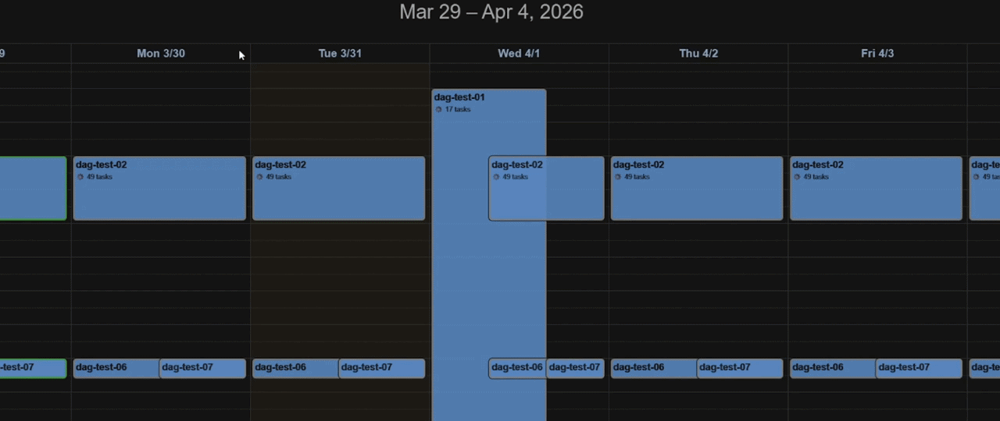
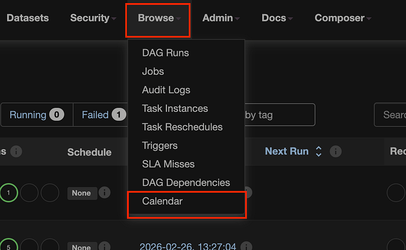

# 📅 Airflow Calendar

[](https://pypi.org/project/airflow-calendar/)
[](https://opensource.org/licenses/Apache-2.0)
[](https://pypi.org/project/airflow-calendar/)

[](https://airflow.apache.org/)

A modern and intuitive calendar interface for visualizing your DAG schedules in Apache Airflow. Transform complex cron expressions into a clear and searchable time grid inspired by the Google Calendar experience.



---

## 🎯 Why Airflow Calendar?

Have you ever felt lost trying to keep track of your Airflow DAG schedules?

When managing complex environments with dozens of DAGs, each with different execution requirements, losing control of your schedule is common.

While Airflow provides features to visualize the execution history of individual DAGs, it lacks a "global" view to see all scheduled DAGs at once.

This is where Airflow Calendar comes in. It provides a visual timeline of all your DAG schedules, allowing you to see at a glance when each DAG is set to run, identify potential overlaps, avoid resource conflicts, and manage concurrency and dependencies effectively.

You can check more details about the project in the [Medium article](https://blog.dataengineerthings.org/airflow-calendar-improving-dag-management-with-a-visual-schedule-cd330df1d644).

## ✨ Key Features

* **Timeline View**: Visualize all your DAG schedules in clear monthly, weekly, or daily grids, making it easy to spot execution windows and potential load spikes.
* **Smart Info-Popup**: Instant access to critical DAG run details upon clicking an event.
    * Displays **Execution Time**, **Cron Expression**, **Estimated Duration**, and **Stats History (Last 5 runs)**.
* **Color-Coded Status**: Immediate visual identification of success, failure, or "no-run" states through dynamic colors.
* **Native Deep Linking**: Directly jump to the native Airflow Grid View for any specific DAG with a single click.

---

## 🚀 Installation

The recommended way to install **Airflow Calendar** is via pip. In your environment where Airflow is installed, run the following command:

```bash
pip install airflow-calendar
```

Otherwise, you can also clone the repository and install it manually by moving the `airflow_calendar` directory to your Airflow plugins folder.

> Note: You may need to restart your Airflow Webserver after installation for the plugin to be picked up.

If everything is set up correctly, you should see a new "Calendar" option under the "Browse" menu in the Airflow UI:



### ⚙️ Configuration & Permissions
If the plugin is loaded but the Calendar option is not visible under the Browse menu, you likely need to grant permissions to your user role:

1. Navigate to **Security > List Roles**.
2. Edit your specific role (e.g., Admin, Op, or Viewer).
3. Add the permission: ```menu access on Calendar```.
4. Save and refresh the page.

### 🔍 Troubleshooting
If the "Calendar" option still doesn't show up in the menu:

- **Check Plugin Status:** Go to Admin > Plugins. You should see ```airflow_calendar``` listed there.
- **Logs:** If it's not listed, check your webserver logs.
- **CLI:** Run ```airflow plugins``` in your terminal to verify if the package was loaded correctly into the environment and check for any errors during loading.

---

## 🛠️ Roadmap
This project is in its early stages. Upcoming features include:

- [ ] **Airflow 3 Compatibility:** Support for the next generation of Airflow.
- [ ] **Tag-Based Filtering:** Filter calendar events using your existing DAG tags.
- [ ] **Dynamic Styling:** Background colors for events based on DAG tags.
- [ ] **Search functionality:** Quickly find specific events within the calendar.

---

## 🤝 Contributing

This project is open to contributions! Whether it's reporting a bug, suggesting a feature, or submitting a Pull Request:

1. Open an issue to discuss the change you wish to make.
2. Fork the repository and create your feature branch.
3. Commit your changes with clear descriptions.
4. Push to the branch and open a Pull Request.
